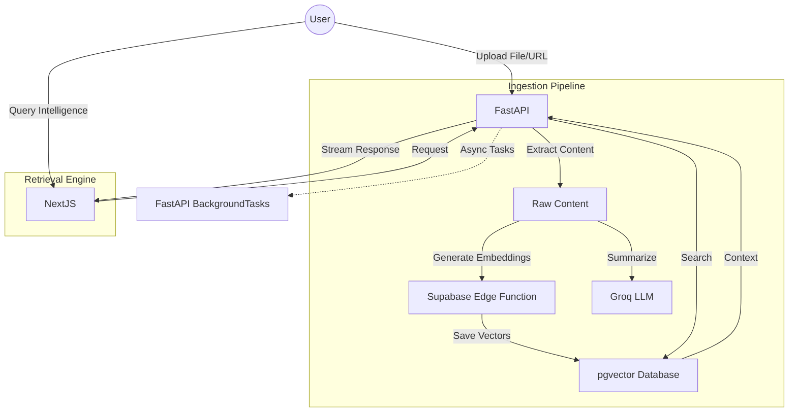

# 🧠 MemoryOS 

<p align="center">
  
</p>

---

## 🌩️ Synaptic Intelligence for Your Second Brain

**MemoryOS** is a high-performance, self-hosted alternative to tools like **NotebookLM** and **Mem.ai**. It combines the speed of **Groq's Llama 3.3 70B** with the reliability of **Supabase pgvector** to create a lightning-fast personal knowledge vault. 

> **Retreive, Chat, and Commit to Long-term Memory — with Zero Latency.**

---

### 💎 Key Features

*   **⚡ Lightning-Fast Ingestion**: Upload PDFs, Notes, Voice Memos, or URLs and get them indexed in milliseconds.
*   **🤖 Advanced RAG Engine**: Pure streaming token delivery via SSE, powered by the world's fastest inference engine (**Groq**).
*   **🧩 Retrieval Practice**: Automatically generate AI-powered Flashcards from your memories to build long-term retention.
*   **🔍 Hybrid Neural Search**: A sophisticated blend of **BM25 keyword matching** and **Vector cosine similarity** (pgvector).
*   **🌐 Grounded Knowledge**: Every response includes verifiable citations from your personal knowledge bank.
*   **🔌 MCP Integration**: Connect your memories directly to **Claude Desktop**, **Cursor**, or **Zed** via Model Context Protocol.

---

### 🛠️ The Power Stack

| Layer | Technology | Rationale |
|---|---|---|
| **Brain** | `Llama 3.3 70B` (Groq) | Ultra-low latency, complex reasoning. |
| **Memory** | `Supabase pgvector` | Scalable PostgreSQL search + RLS security. |
| **Retriever** | `gte-small` (Edge) | High-accuracy embeddings with zero server load. |
| **Frontend** | `Next.js 14` (App) | Premium UX with server-side speed. |
| **Backend** | `FastAPI` (Python) | Robust, asynchronous pipeline execution. |
| **UI/UX** | `Tailwind + Framer` | Dark mode, glassmorphism, fluid animations. |

---

### 📐 Architectural Overview



---

### 🚀 Getting Started (Production)

#### 1. Frontend (Vercel)
*   Push `/frontend` to Vercel.
*   Add `NEXT_PUBLIC_SUPABASE_URL` and `NEXT_PUBLIC_SUPABASE_ANON_KEY`.
*   Point `NEXT_PUBLIC_BACKEND_URL` to your Render API.

#### 2. Backend (Render - Free Tier optimized)
*   Create a Web Service from `/backend`.
*   Variables: `GROQ_API_KEY`, `SUPABASE_URL`, `SUPABASE_SERVICE_KEY`, `USE_CELERY=false`.
*   Deploy — no separate worker service needed!

#### 3. Database (Supabase)
*   Run the migrations in `/supabase/migrations`.
*   Create an `embed` function from the provided edge function code.

---

### 🏠 Local Development

```bash
# 1. Start Backend
cd backend
python -m venv venv
./venv/Scripts/activate
pip install -r requirements.txt
uvicorn app.main:app --reload

# 2. Start Frontend
cd ../frontend
npm install
npm run dev
```

---

### 🛡️ Security & Privacy
*   **End-to-End RLS**: Every row in the database is protected by Supabase Row Level Security.
*   **Self-Hosted**: You own the keys, you own the data.
*   **Grounded Privacy**: Your data is NEVER used for training public models.

---

### 📜 License
MIT © 2026 MemoryOS. **Build your mind.**
